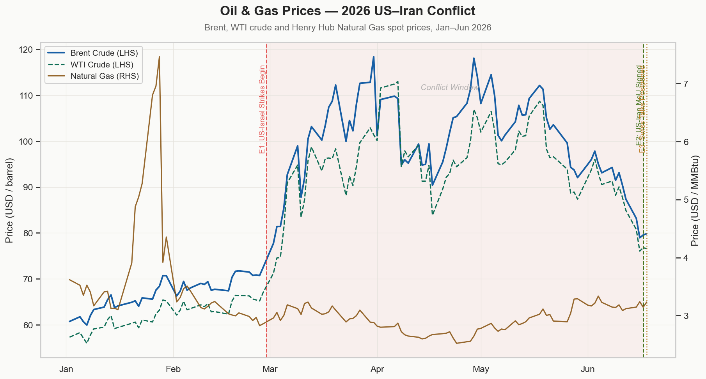
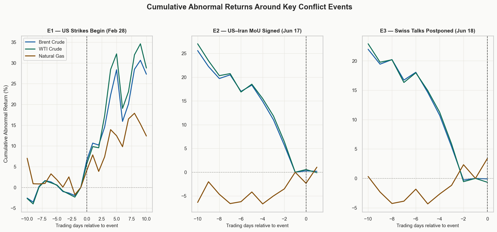
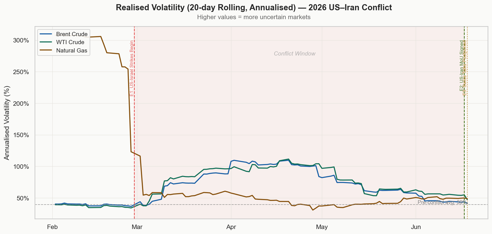
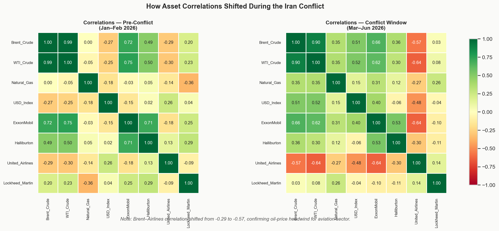
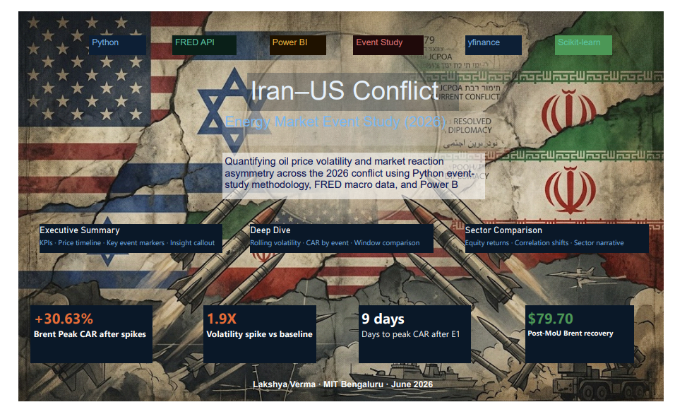
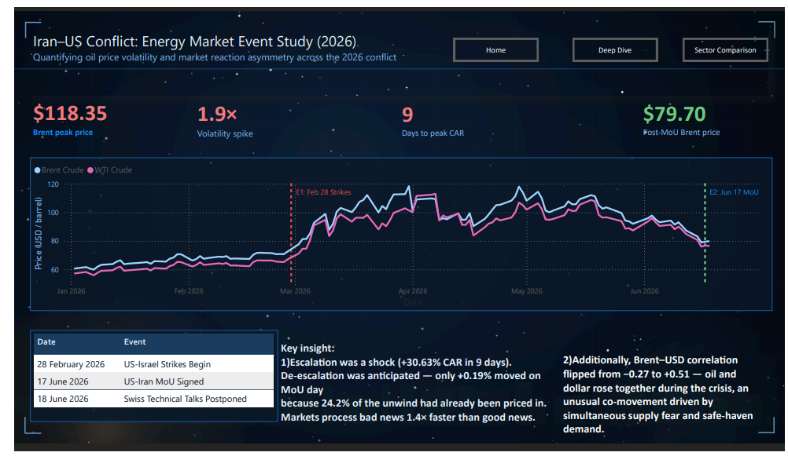
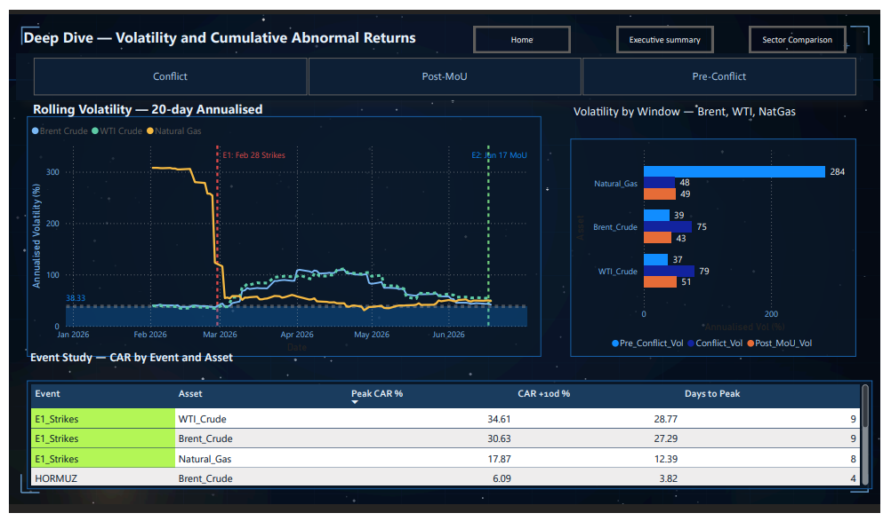
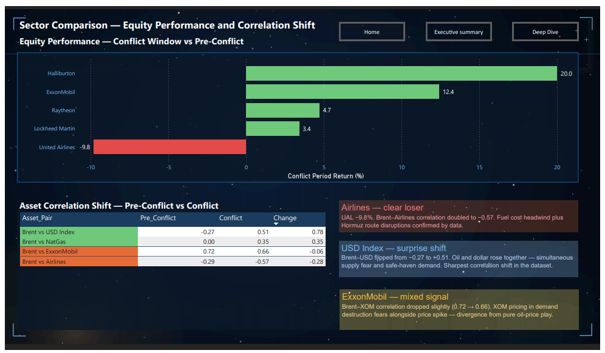

<div align="center">


<br/><br/>

# 🛢️ Iran–US Conflict: Oil & Energy Market Event Study (2026)

### *Quantifying oil-price volatility and market-reaction asymmetry across the 2026 US–Iran conflict using a Python event-study framework, FRED macro data, and Power BI*

<br/>

> **Brent crude surged +30.63% in 9 trading days after the strikes. Markets priced in escalation 1.4× faster than de-escalation — only +0.19% moved on MoU signing day, because 24.2% of the unwind was already priced in.**

<br/>

</div>

---

## 📋 Table of Contents

- [Executive Summary](#-executive-summary)
- [Key Findings](#-key-findings)
- [Analysis Charts](#-analysis-charts)
- [Dashboard](#-dashboard)
- [Methodology](#-methodology)
- [Project Structure](#-project-structure)
- [Tech Stack](#️-tech-stack)
- [How to Run](#️-how-to-run)
- [Further Work](#-further-work)

---

## 🎯 Executive Summary

This project applies a **quantitative event-study framework** to measure how Brent crude, WTI crude, and Natural Gas prices responded to four key dates in the 2026 US–Iran conflict. Daily price data for 10 tickers was pulled via **yfinance**, and FRED macro data via **fredapi**, covering January 2 to June 18, 2026 — spanning the full arc from the pre-conflict baseline through the Strait of Hormuz disruption to the eventual MoU signing.

The sharpest result in the dataset is the **Brent–USD correlation flip from −0.27 to +0.51**: oil and the dollar rose together during the conflict, signalling that markets simultaneously priced in supply fear and safe-haven demand — an unusual co-movement that marks this as both an energy shock and a geopolitical-risk event. Brent crude also posted a **+30.63% cumulative abnormal return over 9 trading days** following the February 28 strikes, while escalation was processed 1.4× faster than de-escalation — the kind of asymmetry analysts use to measure information-diffusion speed.

The Strait of Hormuz carries roughly **20% of global seaborne oil supply**, making conflict-driven chokepoint disruption one of the highest-impact tail risks in commodity markets.

---

## 🔍 Key Findings

<div align="center">

| Metric | Value | Significance |
|--------|-------|-------------|
| 🔴 Brent peak CAR after E1 strikes | **+30.63%** in 9 days | Fastest single-event move in sample |
| 🔴 Volatility spike | **1.9× above baseline** | 39.3% → 75.0% annualised |
| 🔴 Peak annualised volatility | **109.7%** on Apr 20 | At height of Hormuz disruption |
| 🟡 De-escalation speed | **1.4× slower** than escalation | Markets process bad news faster |
| 🟢 Post-MoU normalisation | **42.7%** vol (vs 39.3% pre) | Near-complete recovery |
| 🔵 Brent–Airlines correlation | **−0.29 → −0.57** | Inverse relationship doubled |
| 🔵 Brent–USD correlation | **−0.27 → +0.51** | Rarest finding — correlation flip |
| ⚠️ Natural Gas anomaly | **284% → 48%** vol | Already volatile pre-conflict |

</div>

<br/>

**The USD flip is the standout.** A negative Brent–USD correlation is the historical norm — a weaker dollar makes oil cheaper for non-USD buyers, lifting demand and price. The flip to +0.51 during the conflict means both rose together, driven by supply fear on the oil side and safe-haven flows on the dollar side: a textbook geopolitical risk-premium event.

---

## 📉 Analysis Charts

### Price Timeline with Event Markers
*Brent crude, WTI crude, and Natural Gas across the full conflict arc, with E1, E2, and E3 event markers.*



### Cumulative Abnormal Returns Around Key Events
*CAR for three primary assets across ±10 trading-day windows around each conflict event.*



### Rolling Volatility — 20-day Annualised
*Volatility spike during the conflict window, peaking at 109.7% on April 20, followed by post-MoU normalisation.*



### Asset Correlation Shift: Pre-Conflict vs Conflict
*How relationships between assets changed once the conflict began — most notably the Brent–USD flip.*



---

## 📊 Dashboard

A **4-page interactive Power BI dashboard** — Home, Executive Summary, Deep Dive, and Sector Comparison — built on the exported `dashboard/*.csv` data.

📄 **[Download the full dashboard PDF →](dashboard/IranEnergyDashboard.pdf)**

| Page | Preview |
|------|---------|
| 🏠 **Home** |  |
| 📈 **Executive Summary** — KPIs, price timeline, key events |  |
| 🔬 **Deep Dive** — volatility analysis and CAR study |  |
| 🏢 **Sector Comparison** — equity returns and correlation shifts |  |

> **Reproduce it yourself:** open Power BI Desktop → **Get Data → Text/CSV** → load the four files in `dashboard/`, then build the 4-page layout described above.

---

## 🔬 Methodology

### Event-Study Framework

This project uses the **standard academic event-study framework** from financial economics. For each key conflict date, a **±10 trading-day event window** is defined, and cumulative abnormal returns (CAR) are measured:

```
AR  = actual_return − expected_return
CAR = cumulative_sum(AR)
```

`expected_return` is estimated from the **pre-conflict baseline window** (January 2 – February 27, 2026 — 38 trading days), capturing "normal" market behaviour before any escalation.

```
Baseline window          Event window (±10 trading days)
│ Jan 2 – Feb 27 │ [−10d] │ E1 │ [+10d] ··· [−10d] │ E2 │ [+10d]
└────────────────┘ └────────────────┘        └────────────────┘
  Compute expected      AR = actual − expected      AR measured
  return (μ)            CAR = cumsum(AR)            CAR measured
```

### Volatility Measurement

Rolling 20-day standard deviation of log returns, annualised:

```python
rolling_vol = returns.rolling(20).std() * sqrt(252) * 100
```

Three windows are compared: **Pre-Conflict** (Jan–Feb), **Conflict** (Mar–Jun), and **Post-MoU** (Jun 17 onward).

### Four Event Dates Analysed

| Event | Date | Description |
|-------|------|-------------|
| E1 Strikes | 2026-02-28 | US–Israel strikes begin — primary escalation shock |
| HORMUZ | 2026-03-15 | Representative Strait of Hormuz disruption marker |
| E2 MoU | 2026-06-17 | US–Iran Memorandum of Understanding signed |
| E3 Talks | 2026-06-18 | Swiss technical talks postponed — uncertainty bump |

### A Note on Pre-Event CAR

For events inside the active conflict period (HORMUZ, E2, E3), large pre-event CAR values are **expected** — they reflect the crisis already underway, not a methodology error. The normalisation step subtracts CAR at day −1 so post-event statistics capture only **incremental** event impact.

---

## 📁 Project Structure

```
Iran_Energy_analysis/
│
├── 📂 data/
│   ├── raw/                         ← gitignored (API downloads)
│   └── processed/
│       ├── prices.csv               ← 116 rows × 10 tickers
│       ├── returns.csv              ← log returns, 8 assets
│       ├── volatility.csv           ← 20-day rolling vol
│       ├── volatility_summary.csv   ← window comparison
│       ├── event_study_summary.csv  ← CAR stats per event
│       ├── corr_pre_conflict.csv    ← 8×8 correlation matrix
│       └── corr_conflict.csv        ← 8×8 correlation matrix
│
├── 📂 notebooks/
│   ├── 01_data_collection.py        ← yfinance + FRED pull
│   ├── 02_event_study.py            ← CAR + abnormal returns
│   ├── 03_volatility.py             ← rolling vol + correlations
│   ├── 04_visualization.py          ← 4 publication-quality charts
│   └── 05_powerbi_export.py         ← Power BI CSV exports
│
├── 📂 outputs/
│   ├── price_timeline.png
│   ├── abnormal_returns.png
│   ├── volatility_chart.png
│   ├── correlation_heatmap.png
│   └── key_findings.txt
│
├── 📂 dashboard/
│   ├── IranEnergyDashboard.pdf      ← full dashboard PDF
│   ├── dashboard_page1.png          ← home page screenshot
│   ├── dashboard_page2.png          ← executive summary
│   ├── dashboard_page3.png          ← deep dive
│   ├── dashboard_page4.png          ← sector comparison
│   ├── powerbi_master.csv           ← 116 rows × 16 cols
│   ├── event_annotations.csv
│   ├── vol_summary_powerbi.csv
│   └── event_summary_powerbi.csv
│
├── requirements.txt
├── .env.example
├── .gitignore
└── README.md
```

---

## 🛠️ Tech Stack

<div align="center">

| Tool | Version | Purpose |
|------|---------|---------|
|  | 3.14 | Core analysis language |
|  | 3.0 | Data wrangling and time-series operations |
|  | 2.4 | Log-return calculations and array operations |
| yfinance | 1.4 | Daily OHLCV price data — 10 tickers |
| fredapi | 0.5 | FRED macro data — WTI spot, Brent, CPI |
| Matplotlib + Seaborn | 3.10 | 4 publication-quality analysis charts |
|  | Desktop | 4-page interactive dashboard |
| scipy | 1.17 | Statistical analysis |

</div>

---

## ⚙️ How to Run

### 1. Clone & Install

```bash
git clone https://github.com/lakshyaverma2004/Iran_Energy_analysis
cd Iran_Energy_analysis
pip install -r requirements.txt
```

### 2. Add Your API Key (free)

Create a `.env` file in the project root:

```bash
# Register free at fred.stlouisfed.org (instant approval)
FRED_API_KEY=your_32_char_fred_key_here
```

### 3. Run the Notebooks in Order

```bash
python notebooks/01_data_collection.py   # Pull price + macro data
python notebooks/02_event_study.py        # Abnormal returns and CAR
python notebooks/03_volatility.py         # Rolling vol + correlations
python notebooks/04_visualization.py      # Generate all 4 charts
python notebooks/05_powerbi_export.py     # Export Power BI CSVs
```

### 4. Build the Dashboard

Open Power BI Desktop → **Get Data → Text/CSV** → load the four files from `dashboard/`, apply the dark theme, and build the 4-page layout.

---

## 🔭 Further Work

- **GARCH(1,1) volatility model** — formally model volatility clustering during the conflict window using the `arch` library. The 20-day rolling σ shows the spike; a GARCH model would test whether conflict-period volatility is statistically persistent.
- **India macro angle** — overlay INR/USD and Indian crude-import volumes. India imports ~85% of its oil, much of it from the Middle East, so Hormuz disruptions are a direct macroeconomic shock — adding an emerging-market lens.
- **GDELT media sentiment** — correlate GDELT event-tone scores (free via Google BigQuery) with daily Brent moves. Does sentiment *lead* or *lag* the market? The pre-event CAR data suggests it lags — markets moved before the news cycle caught up.
- **Prediction-model extension** — turn the event study into a binary classifier: given day −5 features (rolling vol, recent CAR, GDELT sentiment), predict whether the next 5-day CAR is positive or negative, using XGBoost.

---

<div align="center">

**Built by [Lakshya Verma](https://github.com/lakshyaverma2004)**
MIT Bengaluru · CS (AI/ML) · June 2026

*If you find this project useful, please ⭐ the repo*

</div>
